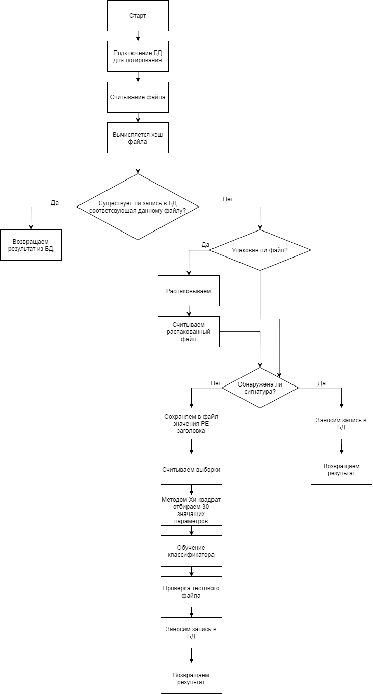

# Algorithm
1.Check the packed PE file. If yes, unpack the file.  
2.Signature Verification.  
3.If the signature is not detected, then the AI starts.  

# Flowchart

# Use
The UPX packer is used as a check for file packaging.  
RandomForest algorithm is used to train the classifier.  
The chi-square method is used to select significant parameters for training.  

# Start
py sign.py filename.exe  
or  
sign.exe filename.exe  
